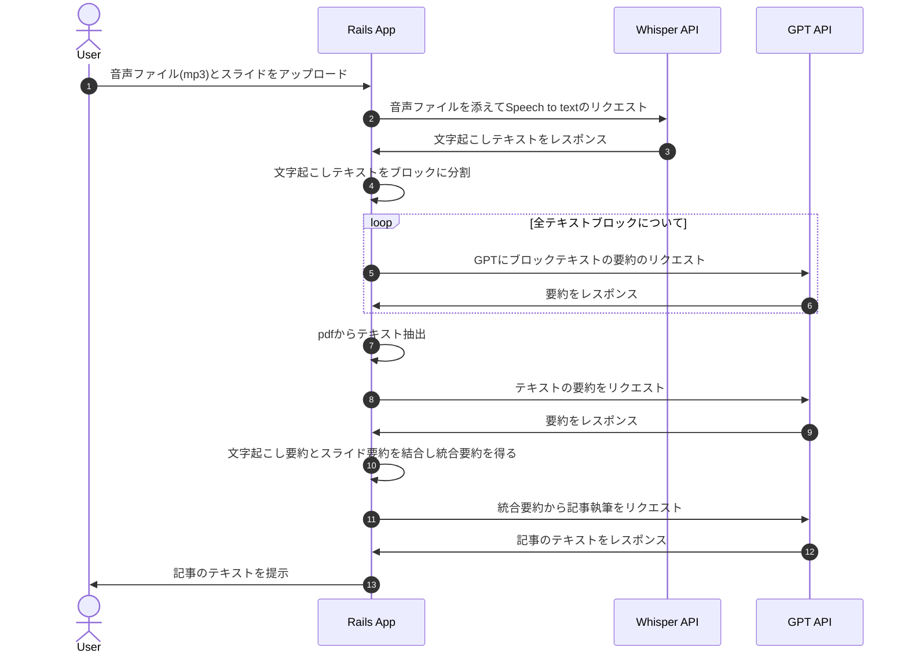
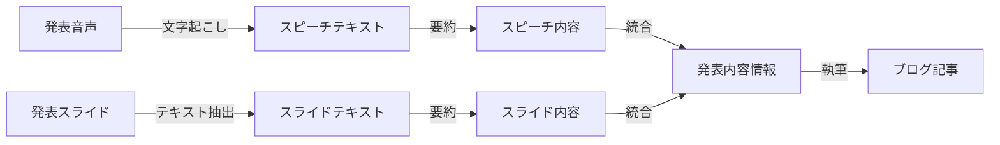

## アプリの概要
技術登壇の際の発表音声と資料をもとに、テックブログの雛形を作成するアプリ

## 実装

- Rails
- ChatGPT API
- Whisper APIs

Ref: Introducing ChatGPT and Whisper APIs
https://openai.com/blog/introducing-chatgpt-and-whisper-apis

## 使用方法と処理

ユーザーは、テックブログにしたい発表の音声データ（MP3）と発表資料（PDF）をアップロードします。アプリ側では、以下の処理を行います。

1. 最初に、発表元の音声データをWhisper APIで解析し、文字起こしデータに変換します。
2. 次に、ChatGPT APIを使用して、文字起こしデータから発表の要約を作成します。ただし、文字起こしデータは文字数が多いため、分割して送信します。各データは、内容が欠如しないようにプロンプトで指定し、箇条書きにまとめてもらいます。
3. PDFの発表資料もChatGPT APIを使用して要約します。PDFはpdf-readerというrubyのライブラリを用いて、一度テキストデータに変換してからAPIにリクエストをしています。ここでも、2と同様に箇条書きにまとめます。
4. 音声とスライドから抽出された2, 3の要約データを使用して、テックブログのフォーマットになるようにプロンプトで指定し、再度ChatGPT APIにリクエストを行います。

## シーケンス

## 処理フロー

